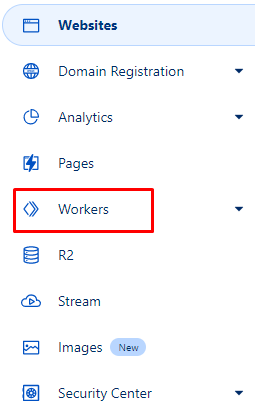
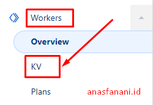
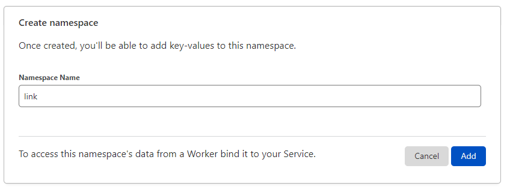
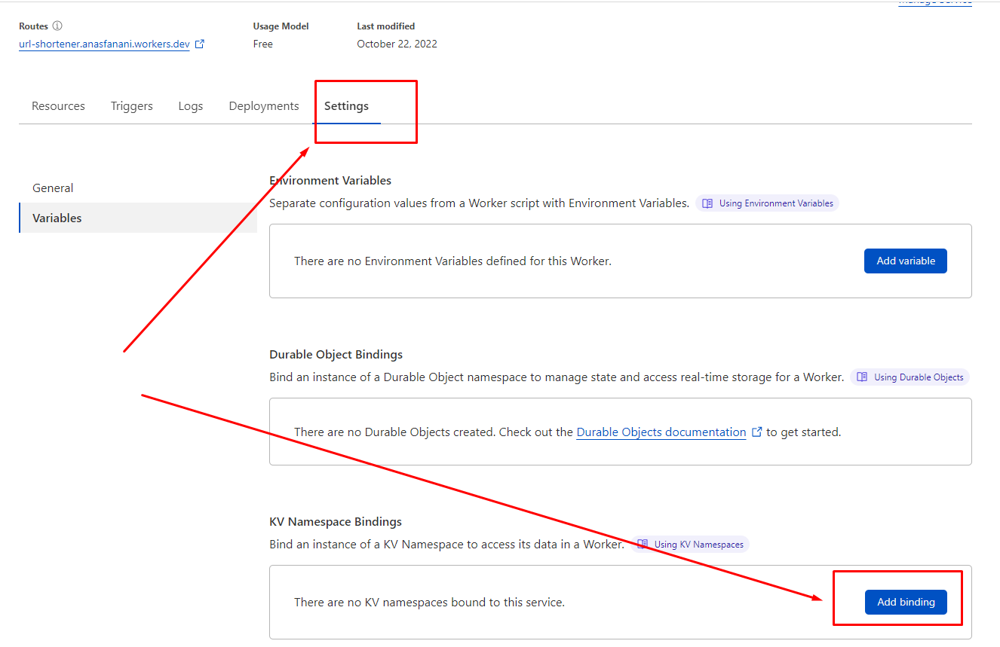
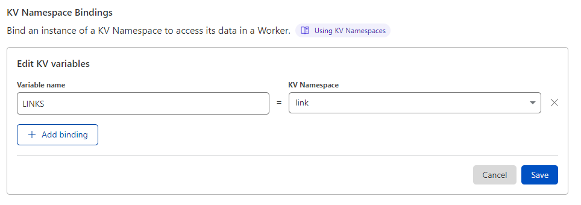
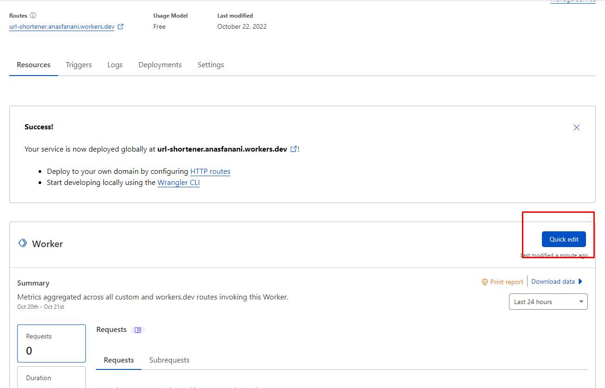
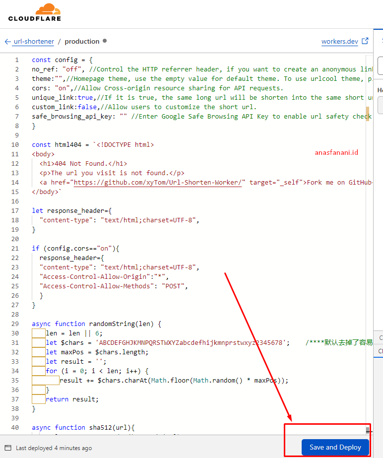
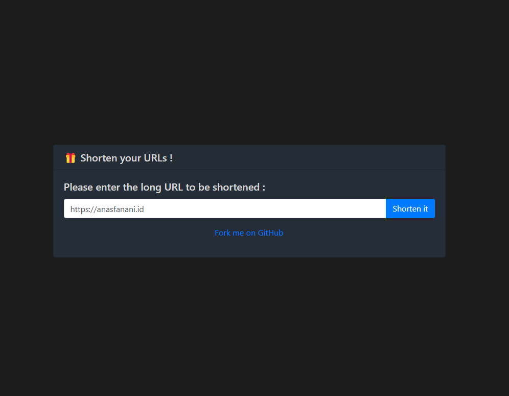

Hello, i will share how to create **Pivate URL Shorteners** without any cost, its free..
In this example we will use cloudflare worker, what is that ? google it xD
As cloudflare says..

- - -

**Cloudflare Worker**
*Build serverless applications and deploy instantly across the globe for exceptional performance, reliability, and scale.*

- - -

So let we build and deploy **Pivate URL Shorteners**
We will using [@xyTom](https://github.com/xyTom) github project, manny thanks for create this project...

Lets do it.

## Signup

Sign Up to https://dash.cloudflare.com/sign-up

Navigate to Workers 

## Setup Worker subdomain

Set up your free custom Cloudflare Workers® subdomain

 You may use this subdomain to deploy your application live to Cloudflare's global network. You can change it at any time.
Now i set it to `yourname` and hit setup button, then choose free plan

## Create a Service

Navigate to Workers menu, and click **Create A Service**  button.
Input service name as you want, then click a **Create Service Button**
Your service will deployed to : http://name.yourname.workers.dev

## Workers KV

Go to Workers KV.

Create a namespace.

Go back to Worker, select Setting 

Bind an instance of a KV Namespace to access its data in a Worker.

## Edit Script

Click Quick edit

Now navigate to https://github.com/xyTom/Url-Shorten-Worker/blob/main/index.js and copy alll script for latest update , paste it , hit save and deploy.

## Done

Done, congratulation, access your url http://name.yourname.workers.dev

Live Demo : <https://url-shortener.anasfanani.workers.dev/>

Live Author Demo :  <https://lnks.eu.org/>

Result Demo : <https://url-shortener.anasfanani.workers.dev/2aPXYr>

Screenshoot : 

