There many method to do this, i will share first method is with cloudflared tunnel.

Lets start.

# Cloudflare Zero Trust

## Requirements

You will need account and a domain.

## Step By Step

### Go to dashboard

Goto dashboard <https://one.dash.cloudflare.com/> 

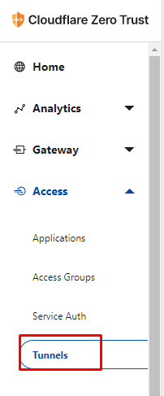

### Create tunnels

Click on a button

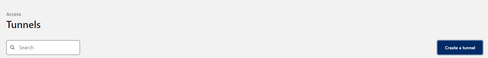

### Configure SERVER

#### Name your tunnels

Give random name

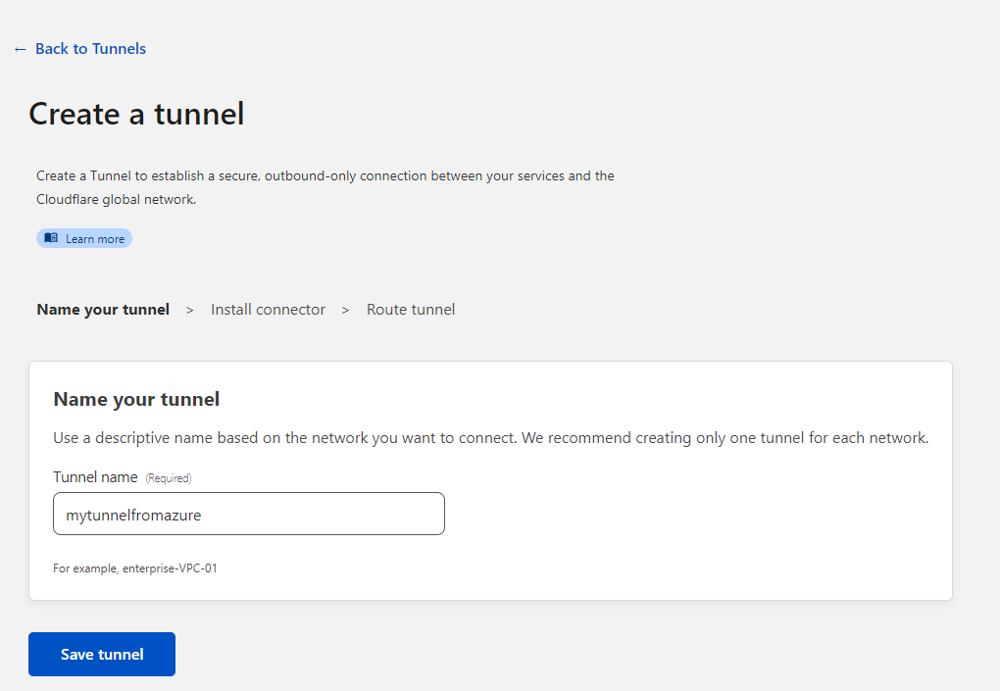

#### Install connector

Here you need to copy the command and execute in server

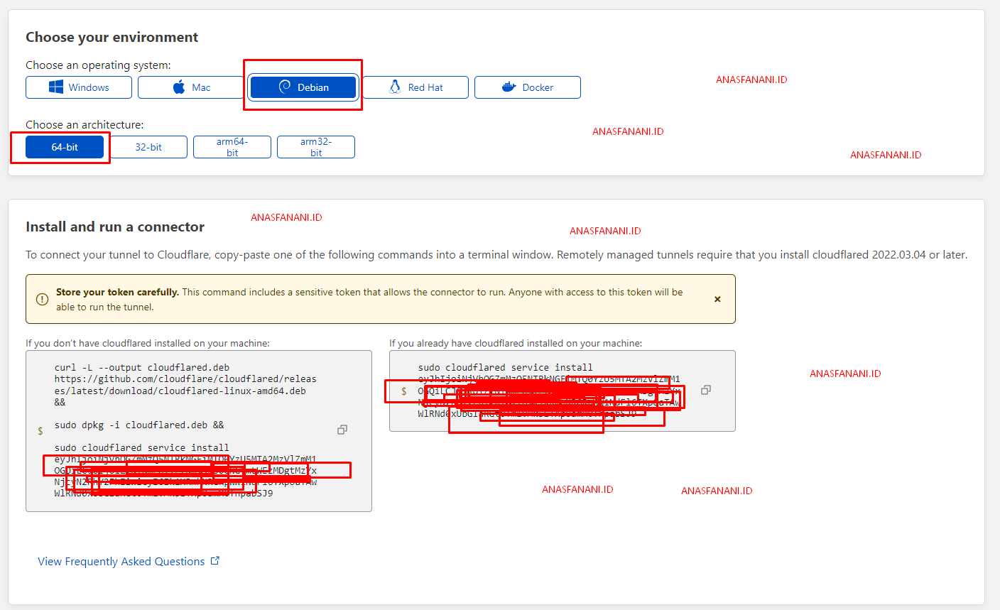

Example :

```
curl -L --output cloudflared.deb https://github.com/cloudflare/cloudflared/releases/latest/download/cloudflared-linux-amd64.deb && 

sudo dpkg -i cloudflared.deb && 

sudo cloudflared service install TOKEN
```

the azure server doestn have sudo, so remove the sudo

```
curl -L --output cloudflared.deb https://github.com/cloudflare/cloudflared/releases/latest/download/cloudflared-linux-amd64.deb && 

dpkg -i cloudflared.deb && 

cloudflared service install TOKEN
```

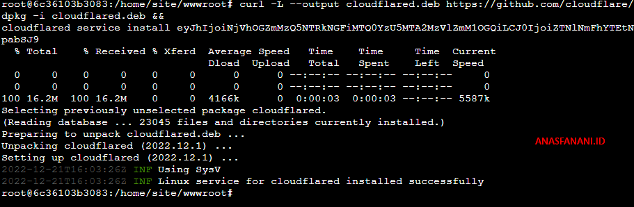

You will got message `INF Linux service for cloudflared installed successfully`

#### Route tunnels

Go back to cloudflare then setup a Route 

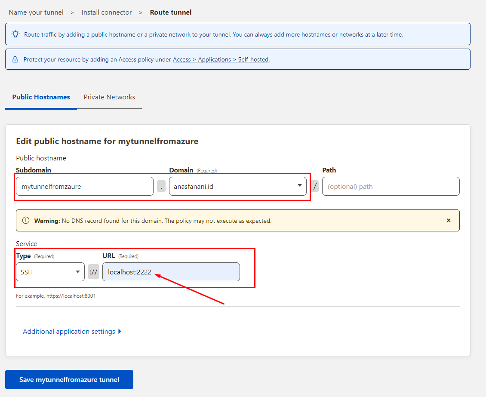

Why use localhost:2222 ?
Because my port ssh server is 2222, default port is 22, so if you use default port, use a localhost:22

Save, and see : 


### Configure CLIENT

#### Setup cloudflared

Download cloudflared for client from <https://developers.cloudflare.com/cloudflare-one/connections/connect-apps/install-and-setup/installation/>

I am using windows , so i download Windows version

<https://github.com/cloudflare/cloudflared/releases/latest/download/cloudflared-windows-amd64.exe>

Save to any folder , example `C:/App/bin`, then configure your PATH variable

Click START, type `path`

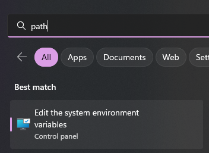

Then follow this step : 

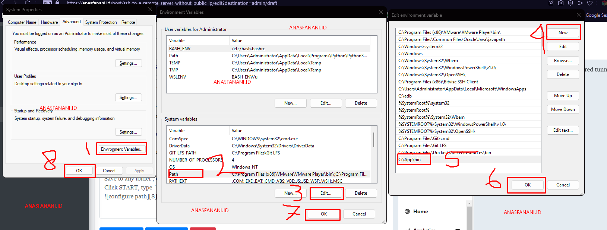

Rename to `cloudflared.exe` 

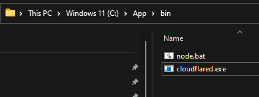

#### Setup SSH

Open SSH configuration

Goto `C:UsersYOUR USERNAME.ssh`

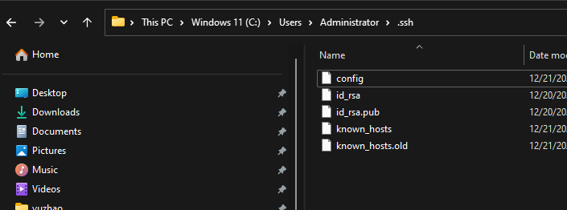

if you have a config file, then modify `config` file, else create new file,fi

Paste code like this

```
Host CHANGE_ME
  HostName CHANGE_ME
  User root
  ProxyCommand C:/App/bin/cloudflared.exe access ssh --hostname %h
```

change CHANGE_ME to your host, example : mytunnelfromzaure.anasfanani.com

Example :

```
Host mytunnelfromzaure.anasfanani.com
  HostName mytunnelfromzaure.anasfanani.com
  User root
  ProxyCommand C:/App/bin/cloudflared.exe access ssh --hostname %h
```

#### Connect SSH

Open your command prompt, type `ssh root@mytunnelfromzaure.anasfanani.com`

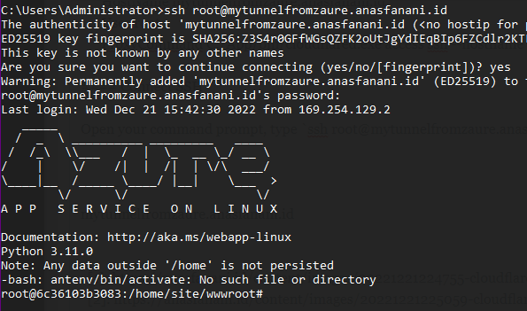

## Conclusion

All step is not simple, if you need a simple step you can use other method

More Method will updated, so stay tuned, dont forget comment