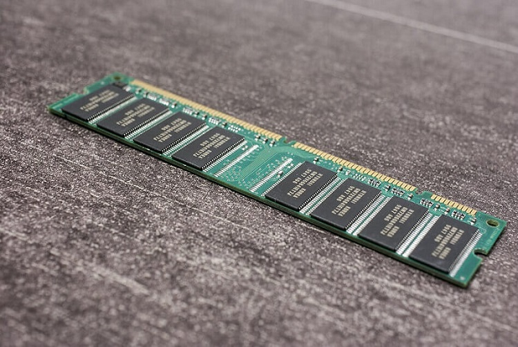
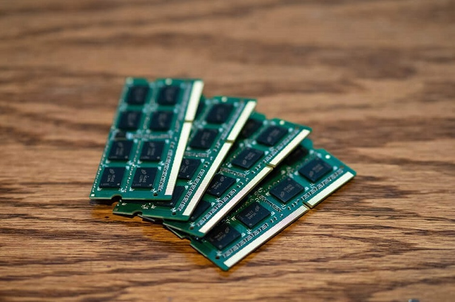

Ada dua istilah yang biasa muncul kalau kita sedang membicarakan RAM. Yaitu RAM jenis DIMM dan RAM SODIMM.

Dan ini masih banyak juga orang yang belum tahu apa perbedaan keduanya. Padahal penting lho supaya nggak salah pilih.

Di sini akan saya bahas ya.

### APA ITU RAM DIMM DAM SODIMM

Sebelum ke inti postingan, saya akan kasih tau sedikit tentang RAM jenis DIMM dan SODIMM.

Anda sampai kesini pasti karena mau upgrade RAM hehe. Silakan cek berikut:

#### RAM DIMM

RAM DIMM atau Dual In-line Memory Module. Jenis RAM ini dipakai di PC .

Ciri fisik dari RAM DIMM ialah ukurannya yang lebih panjang. Meskipun dari segi dimensi lebar sama saja dengan RAM SODIMM.

Hal ini dikarenakan jumlah pin dari RAM DIMM lebih banyak. Mulai dari 168, 184 hingga 240 pin dengan arsitektur 64-bit.

Sedangkan untuk speknya sama seperti RAM pada umumnya. Contoh DDR2, DDR3, DDR4 dan lain-lain seterusnya.

#### RAM SODIMM

RAM SODIMM atau Small Outline Dual In-line Memory Module.

RAM ini pada dasarnya dikhususkan untuk perangkat yang ukurannya lebih kecil. Paling umum sih laptop, atau bisa juga Mini PC.

Ciri fisik dari RAM ini ialah bentuknya yang pendek, dikarenakan menyesuaikan perangkat yang dipasang (laptop/Mini PC). Jumlah pinnya mulai dari 144, 200 sampai 204 pin.

Dari segi spek, RAM SODIMM sama seperti RAM pada umumnya. Hanya saja terdapat versi low voltage seperti DDR3L, DDR4L dan sejenisnya.

### Perbedann Ram DIMM Dan SODIMM

Di sini harusnya Anda sudah dapat sedikit gambaran untuk membedakan ya.

Mudahnya begini. RAM DIMM adalah memori yang dikhususkan untuk PC dekstop, dengan ukuran yang lebih panjang. Sedangkan RAM SODIMM adalah memori yang dikhususkan untuk laptop/Mini PC, dengan ukuran yang lebih pendek.

Keduanya punya slot masing-masing. Dimana RAM DIMM tidak bisa dipasang di slot RAM laptop, begitupun sebaliknya.

Kalau dijadikan tabel seperti ini:

| DIMM                                                             | SODIMM                                                                                                                     |
| ---------------------------------------------------------------- | -------------------------------------------------------------------------------------------------------------------------- |
| Dipakai untuk perangkat PC dekstop                               | Dipakai untuk perangkat laptop                                                                                             |
| Ukuran lebih panjang                                             | Ukuran lebih pendek                                                                                                        |
| Punya jumlah pin 240, 184 atau 168 pin dengan arsitektur 64 bit. | Punya jumlah 72 dan 100 pin untuk arsitektur 32 bit. Sedangkan untuk arsitektur 64 bit, jumlahnya 144, 200 sampai 204 pin. |

### Ahir Kata

Terimakasih sudah membaca, semoga kalian paham ya