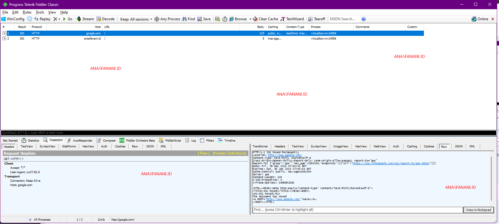
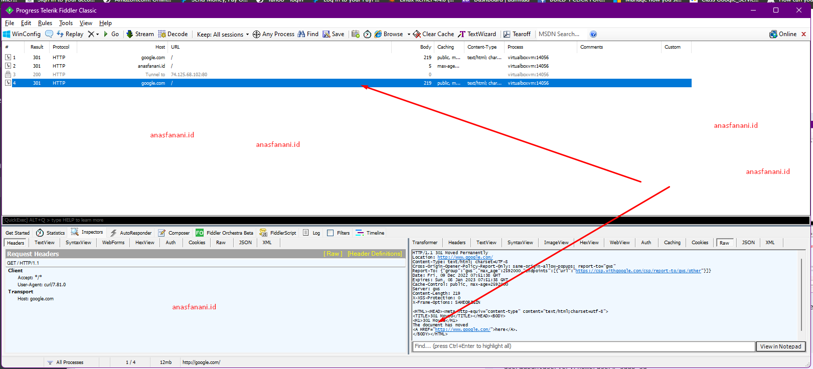
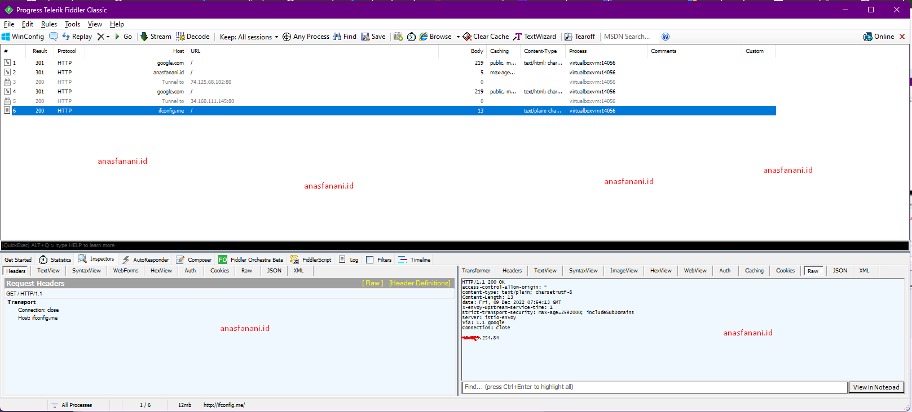
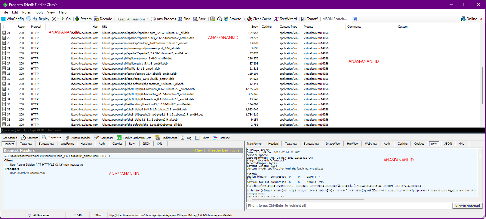

Lets start with simple opening, we dont talk about what is *Fiddler* , we talk about how to redirect all traffict to proxy. 

Login as `root` first.

```
user@ubuntuserver:/home/user# sudo su
```

First we need download `redsocks` and `iptables` in the Linux VM.
Use this command `apt install redsocks iptables -y`

```
root@ubuntuserver:/home/user# apt install redsocks iptables -y
```

Then simply apply this code bellow, you can customize it for what you need.

```
iptables -t nat -N REDSOCKS
# Exclude local and reserved addresses
iptables -t nat -A REDSOCKS -d 0.0.0.0/8 -j RETURN
iptables -t nat -A REDSOCKS -d 10.0.0.0/8 -j RETURN
iptables -t nat -A REDSOCKS -d 127.0.0.0/8 -j RETURN
iptables -t nat -A REDSOCKS -d 169.254.0.0/16 -j RETURN
iptables -t nat -A REDSOCKS -d 172.16.0.0/12 -j RETURN
iptables -t nat -A REDSOCKS -d 192.168.0.0/16 -j RETURN
iptables -t nat -A REDSOCKS -d 224.0.0.0/4 -j RETURN
iptables -t nat -A REDSOCKS -d 240.0.0.0/4 -j RETURN
# Now we need to add a rule that will redirect all packets from our custom REDSOCKS chain to the local port, we will use the default one – 12345
iptables -t nat -A REDSOCKS -p tcp -j REDIRECT --to-ports 12345

# Redirect all HTTP and HTTPS outgoing packets through Redsocks
# iptables -t nat -A OUTPUT -p tcp --dport 443 -j REDSOCKS
# iptables -t nat -A OUTPUT -p tcp --dport 80 -j REDSOCKS
# Redirect all HTTP and HTTPS incoming packets through Redsocks
# iptables -t nat -A PREROUTING -p tcp --dport 443 -j REDSOCKS
# iptables -t nat -A PREROUTING -p tcp --dport 80 -j REDSOCKS
 
 
## Filter all traffic from the own host
## BE CAREFULL HERE IF THE PROXY-SERVER RUNS ON THIS MACHINE
iptables -t nat -A OUTPUT     -p tcp -j REDSOCKS 
# Filter all traffic that is routed over this host
iptables -t nat -A PREROUTING -p tcp -j REDSOCKS
```

After all set, we need configure `/etc/redsocks.conf`
Here the default configuration : 

```
base {
        // debug: connection progress & client list on SIGUSR1
        log_debug = off;

        // info: start and end of client session
        log_info = on;

        /* possible `log' values are:
         *   stderr
         *   "file:/path/to/file"
         *   syslog:FACILITY  facility is any of "daemon", "local0"..."local7"
         */
        log = "syslog:daemon";

        // detach from console
        daemon = on;

        /* Change uid, gid and root directory, these options require root
         * privilegies on startup.
         * Note, your chroot may requre /etc/localtime if you write log to syslog.
         * Log is opened before chroot & uid changing.
         */
        user = redsocks;
        group = redsocks;
        // chroot = "/var/chroot";

        /* possible `redirector' values are:
         *   iptables   - for Linux
         *   ipf        - for FreeBSD
         *   pf         - for OpenBSD
         *   generic    - some generic redirector that MAY work
         */
        redirector = iptables;
}

redsocks {
        /* `local_ip' defaults to 127.0.0.1 for security reasons,
         * use 0.0.0.0 if you want to listen on every interface.
         * `local_*' are used as port to redirect to.
         */
        local_ip = 127.0.0.1;
        local_port = 12345;

        // `ip' and `port' are IP and tcp-port of proxy-server
        // You can also use hostname instead of IP, only one (random)
        // address of multihomed host will be used.
        ip = 172.26.160.1;
        port = 8888;


        // known types: socks4, socks5, http-connect, http-relay
        type = http-connect;

        // login = "foobar";
        // password = "baz";
}

redudp {
        // `local_ip' should not be 0.0.0.0 as it's also used for outgoing
        // packets that are sent as replies - and it should be fixed
        // if we want NAT to work properly.
        local_ip = 127.0.0.1;
        local_port = 10053;

        // `ip' and `port' of socks5 proxy server.
        ip = 192.0.2.1;
        port = 1080;
        login = username;
        password = pazzw0rd;

        // kernel does not give us this information, so we have to duplicate it
        // in both iptables rules and configuration file.  By the way, you can
        // set `local_ip' to 127.45.67.89 if you need more than 65535 ports to
        // forward ;-)
        // This limitation may be relaxed in future versions using contrack-tools.
        dest_ip = 192.0.2.2;
        dest_port = 53;

        udp_timeout = 30;
        udp_timeout_stream = 180;
}

dnstc {
        // fake and really dumb DNS server that returns "truncated answer" to
        // every query via UDP, RFC-compliant resolver should repeat same query
        // via TCP in this case.
        local_ip = 127.0.0.1;
        local_port = 5300;
}

// you can add more `redsocks' and `redudp' sections if you need.
```

In the `/etc/redsocks.conf` configuration, edit `ip` `port` `type` inside `redsocks { }` 
You can use nano or vim

```
root@ubuntuserver:/home/user# nano /etc/redsocks.conf
```

Then edit this : 

```
ip = 172.26.160.1;
port = 8888;
type = http-connect;
```

this is our proxy configuration, if you dont know what the ip host (Windows host) inside VM, you can check it with CMD, type it `ipconfig`

Output is like this : 

```
C:UsersAdministrator>ipconfig

Windows IP Configuration

Ethernet adapter vEthernet (Default Switch):

   Connection-specific DNS Suffix  . :
   Link-local IPv6 Address . . . . . : fe80::bf56:d73a:13b2:84ef%27
   IPv4 Address. . . . . . . . . . . : 172.26.160.1
   Subnet Mask . . . . . . . . . . . : 255.255.240.0
   Default Gateway . . . . . . . . . :

Ethernet adapter vEthernet (WSL):

   Connection-specific DNS Suffix  . :
   Link-local IPv6 Address . . . . . : fe80::3100:e28a:3a04:80ad%36
   IPv4 Address. . . . . . . . . . . : 172.20.48.1
   Subnet Mask . . . . . . . . . . . : 255.255.240.0
   Default Gateway . . . . . . . . . :
```

After all set, restart the redsocks  using `pkill redsocks` , then start again with `redsocks`

```
root@ubuntuserver:/home/user# pkill redsocks
root@ubuntuserver:/home/user# redsocks
root@ubuntuserver:/home/user#
```

Try to execute command like `curl` or `wget` (make sure proxy is running)

execute curl with proxy : `curl --proxy 172.26.160.1:8888 google.com`

```
root@ubuntuserver:/home/user# curl --proxy 172.26.160.1:8888 google.com
<HTML><HEAD><meta http-equiv="content-type" content="text/html;charset=utf-8">
<TITLE>301 Moved</TITLE></HEAD><BODY>
<H1>301 Moved</H1>
The document has moved
<A HREF="http://www.google.com/">here</A>.
</BODY></HTML>
root@ubuntuserver:/home/user# curl --proxy 172.26.160.1:8888 anasfanani.id
root@ubuntuserver:/home/user#
```

Off course we can see the traffict in fiddler proxy because we set `--proxy` in curl



So lets use `curl` without `--proxy`

```
root@ubuntuserver:/home/user# curl google.com
<HTML><HEAD><meta http-equiv="content-type" content="text/html;charset=utf-8">
<TITLE>301 Moved</TITLE></HEAD><BODY>
<H1>301 Moved</H1>
The document has moved
<A HREF="http://www.google.com/">here</A>.
</BODY></HTML>
```



Lets use with other linux program like `php` , execute `php -r "echo file_get_contents('http://ifconfig.me');"` and see the Fiddler

```
root@ubuntuserver:/home/user# php -r "echo file_get_contents('http://ifconfig.me');"
```



You can try see the packet from `apt update` or any other command.



All is set, simple, if you have questions, ask in comments. Thanks
